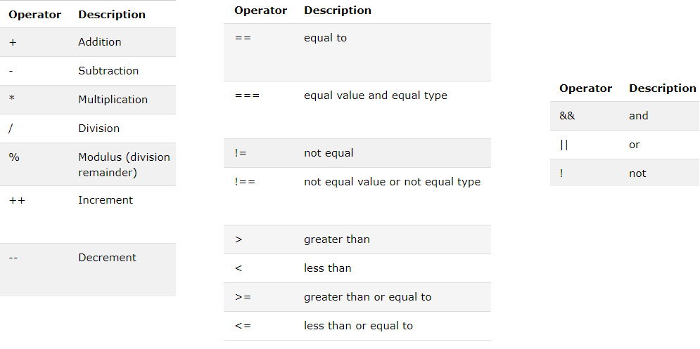

@title[Introduction to Javascript 2]

# Clientside JavaScript

In this course we'll dive deeper into how we can use JavaScript to manipulate aspects of a web page.

+++

### Topics Covered

- Working with the DOM
- Working with CSS classes
- Handling events
- Making AJAX requests

---

@title[Lightning Review]

# Lightning Review

+++

## Variables

```javascript
var myVariable = 'myValue'
```

+++

## Operators



+++

## Conditionals

```javascript
if (condition) {

} else {

}
```

+++

## Arrays

```javascript
array = [1, 2, 3]

a = array[1]

array[2] = 4
```

+++

## Loops

```javascript
for (var i = 0; i < array.length; i++) {
	array[i]
}

while (true) {

}
```

+++

## Functions

```javascript

function functionName (params, params2) {
	return value
}

functionName(1, 2)

```

+++

## Objects

```javascript
var obj = {
	memberName: 'memberValue',
	member2: 123
}

obj.memberName

obj['member2'] = 234
```

---

@title[Basics of OO]

## "Object Oriented" Programming

JavaScript is not "object oriented" in quite the same way as Java is because it doesn't have classes

No classes means we can't do "classical" inheritance

Instead we use <span class="gold">prototypes</span>

+++

## Classes vs. Prototypes

In Java, classes contain all the methods, and are copied into the object when it is instantiated. The object contains the full record of data and methods.

In JavaScript, an object has a reference to its prototypal ancestor.

Compare instantiating 100 classical objects vs. 100 prototypal objects. In classical, each object has its own copy of members and methods, in prototypal each object has its own data, but the methods are only defined once, shared by all the objects.

+++

## Example

function Employee (name, job, salary) {
	this.name = name
	this.job = job
	this.salary = salary
}

Employee.prototype.getPayCheck = function () {
	payout(this, this.salary)
}

var bob = new Employee('Bob', 'Salesman', 45000)

---

https://docs.google.com/document/d/1FFWsS11ANomDw0V0jNnfLCQ2UeMRIN_C0tzAM_GpDY0/edit
